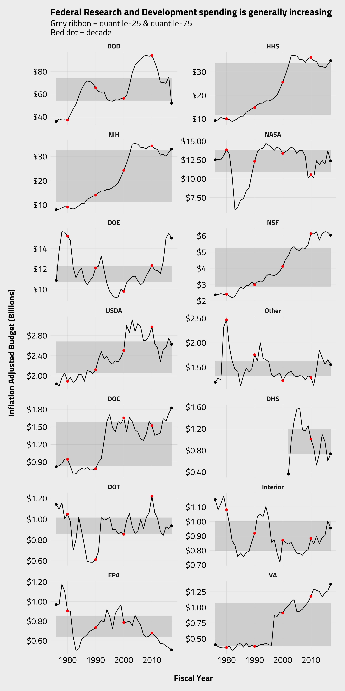
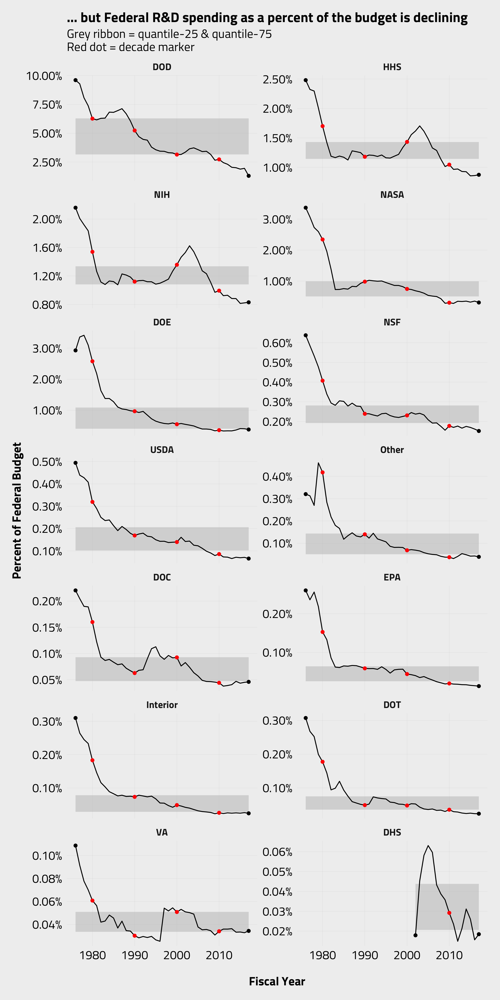

# R&D Budget

Wanted to recreate some sparklines-esque plots in `ggplot2` - I thought the free y-axis was necessary as there was such a difference in levels of spending (DOD super high, interior so low).

### Some resources I used
[Sparkline walkthrough](https://education.arcus.chop.edu/sparklines-ggplot2/)  
[SO Sparklines](https://stackoverflow.com/questions/35434760/sparklines-in-ggplot2)

### Code

[Clean Code](rd_budget_gh.R) 
[Scratch .rmd](rd_budget.Rmd)

[Plot Dollars Carbon](dolllars.png) 
[Plot Percent Carbon](percent.png)

### Final outputs

