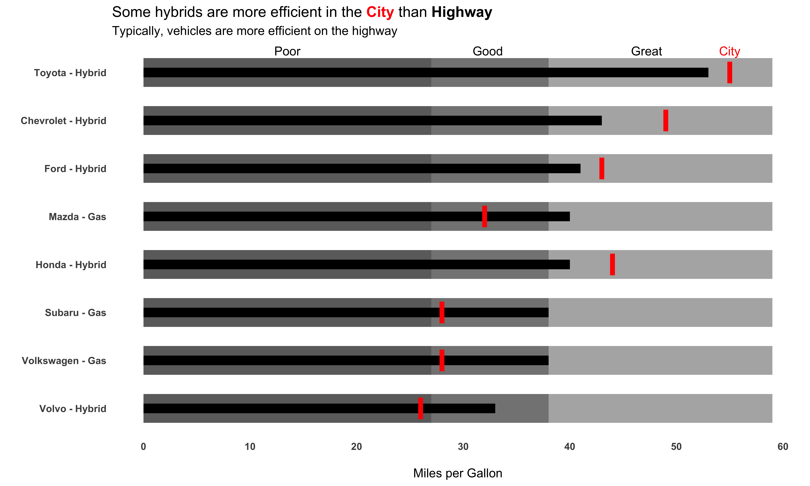

# Big `mtcars` dataset

My try for this week was a [bullet graph](https://en.wikipedia.org/wiki/Bullet_graph) in `ggplot2`.

Code focused on getting the top cars in highway fuel efficiency from a subset of 8 major manufacturers. Found that some hybrids are more fuel efficient in the city than on the highway, which is opposite of traditional fuel vehicles.

Breakdowns of the qualitative ranges:
* Bad = below median (50% quantile or below)
* Good = median up to 95% quantile
* Great = >95% quantile



```

library(tidyverse)
library(ggtext)

big_epa_cars <- readr::read_csv("https://raw.githubusercontent.com/rfordatascience/tidytuesday/master/data/2019/2019-10-15/big_epa_cars.csv")

cars_clean <- big_epa_cars %>%
  janitor::clean_names()

range_cars <- cars_clean %>%
  filter(!is.na(eng_dscr)) %>%
  filter(year == 2018) %>% 
  summarize(q50 = quantile(highway08, probs = 0.50),
            q95 = quantile(highway08, probs = 0.95),
            q100 = quantile(highway08, probs = 1.00))

top_cars <- cars_clean %>%
  filter(!is.na(eng_dscr)) %>%
  filter(year == 2018) %>% 
  group_by(make) %>% 
  top_n(1, city08) %>% 
  ungroup() %>% 
  filter(make %in% c("Subaru", "Volvo", "Chevrolet", "Ford",
                     "Mazda", "Honda", "Toyota", "Volkswagen")) %>%
  distinct(make, .keep_all = TRUE) %>% 
  select(make, model, highway08, city08, eng_dscr, year) %>% 
  arrange(desc(highway08), city08) %>% 
  mutate(eng_type = if_else(str_detect(eng_dscr, "PHEV|Hybrid"), "Hybrid", "Gas")) %>% 
  mutate(make_model = paste(make, eng_type, sep = " - "))

mpg_levels <- top_cars %>% 
  arrange(desc(highway08), city08) %>% 
  pull(make_model)

plot_cars <- top_cars %>% 
  mutate(min_mpg = pull(range_cars, q50),
         middle_mpg = pull(range_cars, q95),
         max_mpg = pull(range_cars, q100)
  ) %>% 
  mutate(make_model = factor(make_model, levels = rev(mpg_levels)))

bar_cars <- plot_cars %>% 
  distinct(make, .keep_all = TRUE)

car_plot <- bar_cars %>% 
  ggplot() +
  geom_col(aes(x = make_model, y = max_mpg), 
           fill = "#A9A9A9", width = 0.6, alpha = 0.9
           ) +
  geom_col(aes(x = make_model, y = middle_mpg), 
           fill = "#808080", width = 0.6, alpha = 0.9
  ) +
  geom_col(aes(x = make_model, y = min_mpg), 
           fill = "#696969", width = 0.6, alpha = 0.9
  ) + 
  geom_col(aes(x = make_model, y = highway08), 
           fill = "black", color = NA, width = 0.2) +
  geom_errorbar(aes(x = make_model, ymin = city08, ymax = city08),
                color = "red", width = 0.45, size = 2) +
  coord_flip() +
  theme_minimal() +
  labs(x = "",
       y = "\nMiles per Gallon",
       title = "Some hybrids are more efficient in the <span style='color:#FF0000'>**City**</span> than <span style='color:#000000'>**Highway**</span>",
       subtitle = "Typically, vehicles are more efficient on the highway") +
  theme(panel.grid = element_blank(),
        plot.title = element_markdown(),
        axis.text = element_text(face = "bold")) +
  annotate("text",
           x = c(rep((8 + .45), 4)),
           y = c(bar_cars$min_mpg[1] * 0.5, bar_cars$middle_mpg[1] * 0.85, 
                 bar_cars$max_mpg[1] * 0.8, bar_cars$city08[1]),
           label = c("Poor", "Good", "Great", "City"),
           color = c(rep("black", 3), "red")
  ) +
  scale_y_continuous(breaks = seq(0, 60, 10)) +
  NULL

car_plot  

ggsave("car_plot.png", car_plot, height = 6, width = 10, units = "in", dpi = 700)
```
