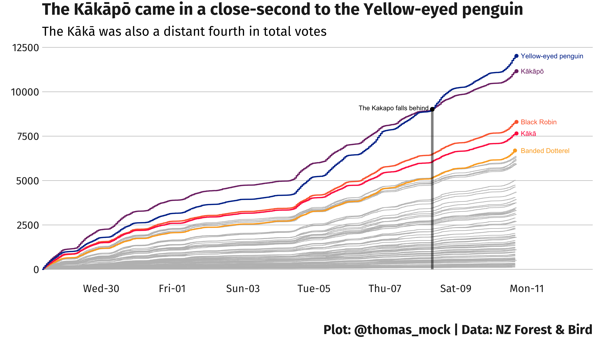

# NZ Birds

The mighty Kākāpō was defeated by a simple penguin.




```{r}
library(tidyverse)


# Load Data ---------------------------------------------------------------

tuesdata <- tidytuesdayR::tt_load("2019-11-19")

nz_bird <- tuesdata$nz_bird


# Combine date + time -----------------------------------------------------

bird_time <- nz_bird %>% 
  mutate(date_hour = str_c(date, hour, sep = " "),
         date_hour = ymd_h(date_hour),
         chunk_time = round_date(date_hour, "4 hours")) 


# Highlight top 5 birds ---------------------------------------------------

top5 <- bird_time %>% 
  group_by(bird_breed) %>% 
  count(sort = T) %>% 
  na.omit() %>% 
  ungroup() %>% 
  slice(1:5) %>% 
  pull(bird_breed)

bird_time %>% 
  group_by(bird_breed) %>% 
  count(sort = T) %>% 
  na.omit() %>% 
  ungroup()


# Create a cumulative summary DF ------------------------------------------

bird_race <- bird_time %>% 
  na.omit() %>% 
  group_by(bird_breed, date_hour) %>% 
  summarize(bird_n = n()) %>% 
  ungroup() %>% 
  group_by(bird_breed) %>% 
  mutate(bird_sum = cumsum(bird_n)) 


# Find where the Kakapo lost ----------------------------------------------

bird_shift <- bird_race %>% 
  select(-bird_n) %>% 
  filter(bird_breed %in% c("Kākāpō", "Yellow-eyed penguin")) %>% 
  group_by(bird_breed) %>% 
  ungroup() %>% 
  pivot_wider(names_from = bird_breed, values_from = bird_sum) %>% 
  mutate(larger = if_else(`Kākāpō` >= `Yellow-eyed penguin`, "No", "Yes")) %>% 
  filter(larger == "Yes") %>% 
  distinct(larger, .keep_all = TRUE) 

bird_hour <- bird_shift %>% 
  pull(date_hour)

bird_point <- bird_shift %>% 
  pull(`Kākāpō`)

# Plot the cumulative votes -----------------------------------------------

bird_plot <- ggplot() +
  geom_step(data = bird_race, aes(x = date_hour, y = bird_sum, group = bird_breed), 
            color = "grey", direction = "hv") + 
  geom_step(data = filter(bird_race, bird_breed %in% top5),
            aes(x = date_hour, y = bird_sum, color = bird_breed),
            direction = "hv", size = 1) +
  geom_point(data = bird_race %>% 
               filter(bird_breed %in% top5) %>% 
               group_by(bird_breed) %>% 
               top_n(1, bird_sum),
             aes(x = date_hour, y = bird_sum, color = bird_breed), size = 2.5) +
  geom_segment(aes(x = bird_hour, xend = bird_hour,
                   y = 0, yend = bird_point), 
               size = 2, alpha = 0.5, color = "black") +
  annotate("point", x = bird_hour, y = bird_point, size = 3, color = "black") +
  geom_text(data = bird_race %>% 
              filter(bird_breed %in% top5) %>% 
              group_by(bird_breed) %>% 
              top_n(1, bird_sum),
            aes(
              # x = date_hour, 
              x = as_datetime("2019-11-10 20:00:00 UTC"),
              y = bird_sum, 
              color = bird_breed, label = bird_breed),
            hjust = 0, size = 4) +
  annotate("text", x = bird_hour, y = bird_point, hjust = 1.05, vjust = 0.2,
           label = "The Kakapo falls behind") +
  labs(x = "",
       y = "",
       title = "The Kākāpō came in a close-second to the Yellow-eyed penguin",
       subtitle = "The Kākā was also a distant fourth in total votes",
       caption = "\nPlot: @thomas_mock | Data: NZ Forest & Bird") +
  tomtom::theme_tomtom() +
  theme(legend.position = "none") +
  scale_color_manual(values = tomtom::tomtom_pal(n = 5, reverse = TRUE)) +
  scale_y_continuous(limits = c(0, 12100)) +
  scale_x_datetime(date_breaks = "2 days",
                   # limits = c(as_datetime("2019-10-28 08:00:00 UTC"), as_datetime("2019-11-11 00:00:00 UTC")),
                   labels = scales::date_format("%a-%d"),
                   expand = expand_scale(mult = c(0, 0.15)))

bird_plot

ggsave("kakapo.png",bird_plot, height = 8, width = 14, units = "in", dpi = "retina")
```
